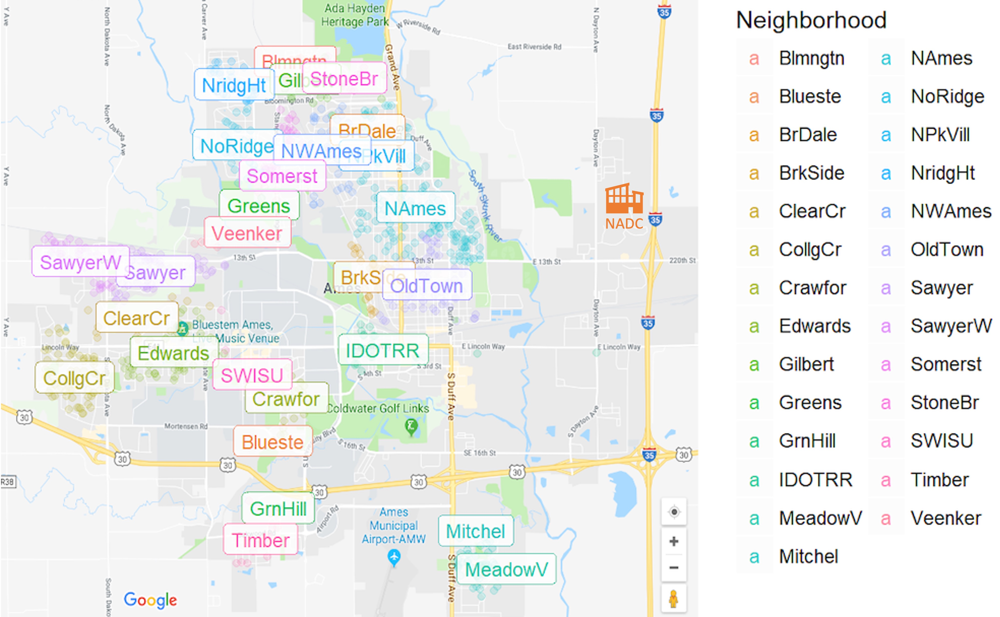

# Ames Housing Sales Price Analysis Project

This project explores the attributes that influence the sales price in Ames city, Iowa, and attempts to model and predict the housing sales price on a given set of attributes.

## Problem Statement

Some professionals have been posted to the US Department of Agriculture (USDA) Agricultural Research Service's National Animal Disease Center (NADC).\
These folks (some have families, while some are singles) are interested to know what housing features or attributes they should be looking out for, and what are the trade-offs in costs they should weigh and consider as they go about house-hunting.\
Many housing agents are excited about the sudden influx of business and commissions. You are no different and would like to set yourself apart from the crowd of agents to secure these potential clients.

## Data Sources

* [DSI-US-11 Regression Challenge (train.csv)](https://www.kaggle.com/c/dsi-us-11-project-2-regression-challenge)

## Outside Research

Ames is a relatively small city with an area of approximately 72km2. Ames is best known as the home of Iowa State University (ISU). In fact, ISU lies at the heart of the city surrounded by all residential neighbourhoods in Ames. The city of Ames has a historic tradition of supporting strong neighborhoods which forms the foundation of a vibrant community.\
For an house hunter, one can be assured of a supportive community regardless of the neighborhood that one chooses to stay in.\
For someone who have daily commutes to the NADC which is situated adjacent to Interstate 35, expect private commute time to be well within 20 minutes even if one stay at the opposite far end of Ames city, in the neighbourhood of CollgCr (College Creek).\
Ames has a humid continental climate with 4 seasons. Summer averages around 30℃ while winter can get to sub-zeros.\
[*reference: wikipedia*](https://en.wikipedia.org/wiki/Ames,_Iowa)\
[*reference: cityofames.org*](https://www.cityofames.org/living/neighborhoods)

\([*credits: picture source*](https://rstudio-pubs-static.s3.amazonaws.com/337439_24918eaefe724411be93e41ede48b256.html))

## Data Dictionary

|Feature|Type|Dataset|Description|
|:-|:-:|:-|:-|
|	ms_subclass	|	int	|	ames3	|	 The building class	|
|	ms_zoning	|	int	|	ames3	|	 Identifies the general zoning classification of the sale.	|
|	lot_frontage	|	float	|	ames3	|	 Linear feet of street connected to property	|
|	lot_area	|	int	|	ames3	|	 Lot size in square feet	|
|	lot_shape	|	int	|	ames3	|	 General shape of property	|
|	land_contour	|	object	|	ames3	|	 Flatness of the property	|
|	lot_config	|	int	|	ames3	|	 Lot configuration	|
|	neighborhood	|	int	|	ames3	|	 Physical locations within Ames city limits	|
|	condition_1	|	int	|	ames3	|	 Proximity to main road or railroad	|
|	bldg_type	|	int	|	ames3	|	 Type of dwelling	|
|	house_style	|	int	|	ames3	|	 Style of dwelling	|
|	overall_qual	|	int	|	ames3	|	 Overall material and finish quality	|
|	overall_cond	|	int	|	ames3	|	 Overall condition rating	|
|	year_built	|	int	|	ames3	|	 Original construction date	|
|	year_remod/add	|	int	|	ames3	|	 Remodel date (same as construction date if no remodeling or additions)	|
|	roof_style	|	object	|	ames3	|	 Type of roof	|
|	exterior_1st	|	int	|	ames3	|	 Exterior covering on house	|
|	exterior_2nd	|	object	|	ames3	|	 Exterior covering on house (if more than one material)	|
|	mas_vnr_type	|	object	|	ames3	|	 Masonry veneer type	|
|	mas_vnr_area	|	float	|	ames3	|	 Masonry veneer area in square feet	|
|	exter_qual	|	int	|	ames3	|	 Exterior material quality	|
|	exter_cond	|	int	|	ames3	|	 Present condition of the material on the exterior	|
|	foundation	|	object	|	ames3	|	 Type of foundation	|
|	bsmt_qual	|	float	|	ames3	|	 Height of the basement	|
|	bsmt_cond	|	float	|	ames3	|	 General condition of the basement	|
|	bsmt_exposure	|	int	|	ames3	|	 Walkout or garden level basement walls	|
|	bsmtfin_type_1	|	int	|	ames3	|	 Quality of basement finished area	|
|	bsmtfin_sf_1	|	float	|	ames3	|	 Type 1 finished square feet	|
|	bsmtfin_type_2	|	object	|	ames3	|	 Quality of second finished area (if present)	|
|	bsmtfin_sf_2	|	float	|	ames3	|	 Type 2 finished square feet	|
|	bsmt_unf_sf	|	float	|	ames3	|	 Unfinished square feet of basement area	|
|	total_bsmt_sf	|	float	|	ames3	|	 Total square feet of basement area	|
|	heating_qc	|	int	|	ames3	|	 Heating quality and condition	|
|	1st_flr_sf	|	int	|	ames3	|	 First Floor square feet	|
|	2nd_flr_sf	|	int	|	ames3	|	 Second floor square feet	|
|	low_qual_fin_sf	|	int	|	ames3	|	 Low quality finished square feet (all floors)	|
|	gr_liv_area	|	int	|	ames3	|	 Above grade (ground) living area square feet	|
|	bsmt_full_bath	|	float	|	ames3	|	 Basement full bathrooms	|
|	bsmt_half_bath	|	float	|	ames3	|	 Basement half bathrooms	|
|	full_bath	|	int	|	ames3	|	 Full bathrooms above grade	|
|	half_bath	|	int	|	ames3	|	 Half baths above grade	|
|	bedroom_abvgr	|	int	|	ames3	|	 Number of bedrooms above basement level	|
|	kitchen_abvgr	|	int	|	ames3	|	 Number of kitchens	|
|	kitchen_qual	|	int	|	ames3	|	 Kitchen quality	|
|	totrms_abvgrd	|	int	|	ames3	|	 Total rooms above grade (does not include bathrooms)	|
|	fireplaces	|	int	|	ames3	|	 Number of fireplaces	|
|	fireplace_qu	|	float	|	ames3	|	 Fireplace quality	|
|	garage_type	|	int	|	ames3	|	 Garage location	|
|	garage_yr_blt	|	float	|	ames3	|	 Year garage was built	|
|	garage_finish	|	int	|	ames3	|	 Interior finish of the garage	|
|	garage_cars	|	float	|	ames3	|	 Size of garage in car capacity	|
|	garage_area	|	float	|	ames3	|	 Size of garage in square feet	|
|	garage_qual	|	float	|	ames3	|	 Garage quality	|
|	wood_deck_sf	|	int	|	ames3	|	 Wood deck area in square feet	|
|	open_porch_sf	|	int	|	ames3	|	 Open porch area in square feet	|
|	enclosed_porch	|	int	|	ames3	|	 Enclosed porch area in square feet	|
|	3ssn_porch	|	int	|	ames3	|	 Three season porch area in square feet	|
|	screen_porch	|	int	|	ames3	|	 Screen porch area in square feet	|
|	pool_area	|	int	|	ames3	|	 Pool area in square feet	|
|	fence	|	object	|	ames3	|	 Fence quality	|
|	misc_val	|	int	|	ames3	|	 $Value of miscellaneous feature	|
|	mo_sold	|	int	|	ames3	|	 Month sold	|
|	yr_sold	|	int	|	ames3	|	 Year sold	|
|	sale_type	|	object	|	ames3	|	 Type of sale	|
|	saleprice	|	int	|	ames3	|	Sale price of the house, also the target variable	|
|	location	|	int	|	ames3	|	Location attributes for each house, refer to note 1	|
|	house	|	int	|	ames3	|	House attributes for each house, refer to note 2	|
|	garage	|	float	|	ames3	|	Garage attributes for each house, refer to note 3	|
|	basement	|	float	|	ames3	|	Basement attributes for each house, refer to note 4	|
|	age_at_sale	|	int	|	ames3	|	Age of the house at time of sale	|
|	remod_age_at_sale	|	int	|	ames3	|	Remodelled age of the house at time of sale	|
|	log_saleprice	|	float	|	ames3	|	Natural logarithm of the sale price	|
|	log_gr_liv_area	|	float	|	ames3	|	Natural logarithm of the above grade living area	|
|	log_lot_area	|	float	|	ames3	|	Natural logarithm of the lot size	|
|	log_1st_flr_sf	|	float	|	ames3	|	Natural logarithm of the 1st floor area	|

Notes:\
note 1 - location attributes are an amalgamation of ms_zoning, log_config, neighborhood and condition 1. It describes the physical geography and location of the house.\
note 2 - house attributes are an amalgamation of ms_subclass, bldg_type, house_style and exterior_1st. It describes some key physical attributes of the house.\
note 3 - garage attriutes are an amalgamation of garage_type, garage_finish and garage_qual. It describes some key physical attributes of the garage.\
note 4 - basement attributes are an amalgamation of bsmt_qual, bsmt_cond, bsmt_exposure and bsmtfin_type. It describes some key physical attributes of the basement.

## Executive Summary

An influx of home seekers are making housing agents excited in a relatively calm housing market in Ames with its small population. To capitalize on this opportunity, I have developed a relative quick and simple regression model through supervised machine learning.

Because I have utilized a natural logarithm function on the housing sales price, some transformation is carried out to interpret the coefficients of the modelled equation.

To that end, the interpreted equation coefficients and variables are on a multiplicative scale relative to each other, i.e. y = exp(ax1) * exp(bx2) * ... * k-constant instead of the conventional y = ax1 + bx2 + ... + k-constant that speaks to an absolute and independent interpretation of each variable and its coefficient.

Notwithstanding that, this model fulfills the main criteria on translating and understanding the impact of housing attributes to its sales price, with a R-sq score of 0.86.

While this model meets the minimum viable product (MVP) requirement, it remains a continuous work in progress to update and tune it as the housing data we have used to train the model are all backdated to least 6 years ago.

## Conclusions

Through the deployment of a supervised machine learning regression model, i.e. providing known dataset to the machine to run an ordinary least squares regression, I am able to derive an optimum model after tuning for the hyperparameters on L1 and L2 penalties through Lasso and Ridge respectively. A simpler linear regression was also conducted to compare the respective models performance.

Given the results, my choice of model would be between ridge and linear regression. Both have very similar R-sq, RMSE, even the coefficients, and they are really not that different. Lasso is not selected as the lasso model has been scaled, therefore its coefficients needs to be rescaled before we can make meaningful interpretation. Thus, since there are no significant advantages in adopting the lasso model, I have narrowed my selection to between ridge and linear regression.

| model             | test R-sq | test RMSE |
|:------------------|:---------:|:---------:|
|lasso	            |  0.87552  |  0.14266  |
|ridge	            |  0.87558  |  0.14262  |
|linear regression  |  0.87557  |  0.14262  |

Since the linear regression model and ridge are similar, I have chosen the linear regression model for simplicity. (recurring theme :)\
Because the y-variable is log sale price, the model coefficient needs to be transformed into an exp(coefficient) which I have already done so below.\
Given all things equal, for every unit increase in any of the below feature, there will be a corresponding multiplicative impact on the sale price as shown in the table.\
E.g. If say, a house in a particular neighbourhood is currently valued at 200k\$.\
If we compare it to an identical and adjadent house with similar attributes save for its the overall quality being higher by 1 rating, say from 6 to 7 (in a scale of one to ten).\
In this case, the model predicts that the sale price of the house will be higher by a magnitude of 1.0563x, to 211k\$.\
We can also use this model to compare houses with different attributes to understand their expected difference in sale price.

Details in the below table:

| feature          | multiplicative impact for 1 unit increase in feature |       description       |
|:-----------------|:---------------------------------------:|:-------------------------------------|
|log_gr_liv_area   |       1.3814          | natural log of grade living area of the house          |
|log_1st_flr_sf    |       1.1975          | natural log of 1st floor square footage of the house   |
|neighborhood	   |       1.0757          | neighborhood precinct of the house (note 6_)             |
|kitchen_qual	   |	   1.0619          | kitchen quality (note 1)                               |
|overall_qual      |       1.0563          | overall material and finishing quality (note 2)        |
|garage_cars	   |	   1.0464          | size of garage in cars capacity                        |
|bsmt_qual         |       1.0422          | height of the basement (note 3)                        |
|fireplace_qu      |       1.0175          | fireplace quality (note 4)                             |
|garage		       |       1.0070          | garage attributes (note 5)                             |
|age_at_sale       |       0.9995          | age of the house                                       |
|remod_age_at_sale |       0.9985          | number of years since last remodelling done            |
|full_bath	       |       0.9643          | number of full bathrooms above grade                   |

Notes: refer to data dictionary for further details.\
note 1 - kitchen quality on a scale of 1-5, where 1=poor and 5=excellent\
note 2 - overall material and finishing quality on a scale of 1-10, where 1=very poor and 10=very excellent\
note 3 - basement quality in terms of its height on a scale of 1-5, where 1=very poor, 5=excellent and 0=no basement\
note 4 - fireplace quality on a scale of 1-5, where 1=very poor, 5=excellent and 0=no fireplace\
note 5 - garage attributes, an amalgamation of garage type * garage finish * garage quality, where

|garage type (gt) | gt assigned value |garage finish (gf)| gf assigned value|garage quality (gq)| gq assigned value|
|:----------------|:-----------------:|:-----------------|:----------------:|:------------------|:----------------:|
|attached         |          2        |finished          |          2       |excellent          |         5        |
|detached         |          1        |rough finished    |          2       |good               |         4        |
|builtin          |          2        |unfinished        |          1       |typical            |         3        |
|basement         |          1        |no garage         |          0       |fair               |         2        |
|2Types           |          1        |                  |                  |poor               |         1        |
|carport          |          1        |                  |                  |no garage          |         0        |
|no garage        |          0        |

note 6 - neighborhood groupings as follows:

| neighborhood | group |
|:----------|:-----:|
|	Blmngtn	|	2	|
|	Blueste	|	1	|
|	BrDale	|	1	|
|	BrkSide	|	1	|
|	ClearCr	|	2	|
|	CollgCr	|	2	|
|	Crawfor	|	2	|
|	Edwards	|	1	|
|	Gilbert	|	2	|
|	Greens	|	2	|
|	GrnHill	|	3	|
|	IDOTRR	|	1	|
|	Landmrk	|	1	|
|	MeadowV	|	1	|
|	Mitchel	|	2	|
|	NAmes	|	1	|
|	NoRidge	|	3	|
|	NPkVill	|	1	|
|	NridgHt	|	3	|
|	NWAmes	|	2	|
|	OldTown	|	1	|
|	Sawyer	|	1	|
|	SawyerW	|	2	|
|	Somerst	|	2	|
|	StoneBr	|	3	|
|	SWISU	|	1	|
|	Timber	|	2	|
|	Veenker	|	2	|

## Recommendations

As home seekers, you might be particularly interested in certain neighbourhoods to buy a house at, or if you are keen to know how the sale price of the house vary with their attributes and properties. If you have a specific query regarding these, I could certainly help with providing you details on the expected price differences.

For example, some attributes that you may be considering could be the size of the house, the kitchen quality, the garage quality, the age of the house, etc.\
As an illustration, if you are considering between 2 similar adjacent houses in the same neighbourhood. And these houses are quite similar except that one has an excellent quality fireplace while another does not have a fireplace. Then you are looking at a 9% price difference between them.

Lets say the one without a fireplace costs \$200k, the one with the excellent fireplace will then cost you \$18k more at \$218k.\
If you have a very specific house that you are looking at, given their attributes, I could also provide you with an expected sale price of the house.

Knowing the expected damage to your pocket could help you assess if you are willing to pay for a better quality feature or if the extra costs are not worthwhile.

So wait no longer, sign up as me for a comprehensive housing consulting service and makes your house hunting endeavour seamless and stress-free.
